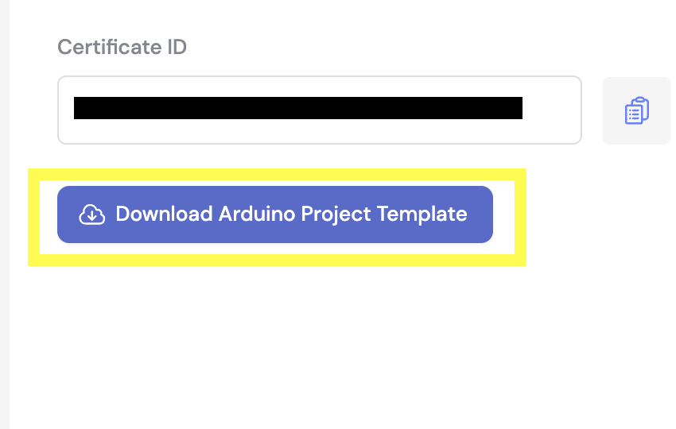

# Golain Arduino SDK

## Introduction

The Golain Arduino SDK is a C++ Software Development Kit crafted for seamless integration with the Golain IoT Platform. 
Built on the Arduino framework, this SDK ensures a quick and efficient setup, allowing developers to connect their IoT 
devices through various communication methods. The SDK supports Wi-Fi, GSM, 4G, LTE, LoRaWAN, and NB-IoT using TinyGSM, 
offering a comprehensive solution for a wide range of IoT applications.

## Features

| Feature          | Status   |
|------------------|----------|
| Device Shadow    | &#x2714; |
| Device Logs      | &#x2714; |
| Device Data      | &#x2714; |
| User Association | &#x2714; |
| OTA              | &#x2714; |
| BLE              | `alpha`  |
| Embedded RPC     | &#x2718; |

## Supported Hardware and Testing Status

| Hardware               | Status   | Tested   |
|------------------------|----------|----------|
| ESP32-WROOM32-D        | `stable` | &#x2714; |
| ESP32-C3               | `stable` | &#x2714; |
| ESP32-S3               | `stable` | &#x2714; |
| ESP32-C6               | `stable` | &#x2714; |
| nRF52840-DK + SIM7600E | `dev`    | &#x2714; |
| nRF52832-DK + SIM800L  | `dev`    | &#x2714; |
| nRF9160                | `dev`    | &#x2714; |

Refer to Example Projects for more details.

## Getting Started

### Prerequisites

1. **Arduino IDE**
    - Download and install Arduino IDE from [here](https://www.arduino.cc/en/software) for your operating system.

2. **Libraries dependencies for Arduino IDE**
    - Install `Arduino_Uno_WiFi_Dev_Ed_Library` by Arduino and `ArduinoJson` by Benoit from the library section. You can access it from the menu bar < Tools < Manage Libraries... section.
    - Also you need 2 more libraries installed, `pubsubclient` by knolleary and `nanopb` by nanopb. You can find both the download links here: [pubsubclient](https://github.com/knolleary/pubsubclient) and [nanopb](https://github.com/nanopb/nanopb). Once downladed add these  to the libraies folder.

2. **Boards for Arduino IDE**
    - Install `esp32` by Espressif board from the *BOARDS MANAGER* section. You can access it from the menu bar < Tools < Board: < Boards Manager section.

### Setup

1. **Setting up the essentials**
    - Download the golain-arduino-sdk on your machine.
    - Now place that sdk folder in libraries folder of your Arduino IDE.

4. **Get device credentials from [Golain Console](https://web.golain.io)**
    - Login to Golain Console and navigate to the `Devices` section.
    - Click on `Add Device` and follow the instructions.
    - Download the `certs.h` file and place it in your project's `main` folder.
    - Also, download the `project template` and place its contents in the `main` folder.

    

5. **Final steps**
    - Open `main.ino` file and just ensure all the important files are present in the `main` folder. These include certs, shadow and data points.

6. **Verify your ESP32 board connection**
    - Ensure your ESP32 board appears on the `Serial Port` from the `device` section

7. **Build and flash the program**
    - Once all dependencies and files are placed and modified, build the program. Your build will be flashed onto the board.

8. **Verify device status**
    - If everything is done correctly, you should be able to see your device online on the [Golain Console](https://web.golain.io). And if you have included any `data points`, you will be able to see its logs in the definations section on your [Golain Console](https://web.golain.io).

## Example Project
you can refer this [shadow example](assets/shadow_example.md) and [data-points example](assets/data-points_example.md) to try on an example on your own

## Contributing
We welcome contributions to enhance the Golain Arduino SDK. Please submit pull requests to the GitHub repository.

## Support
For support and troubleshooting, please visit the Golain [support page](https://scheduler-web-development.azo.dev/consumers/event/166/golain-solutions) or contact us via [email](ishan@golain.io).

## License
This project is licensed under the MIT License. See the [LICENSE file](https://github.com/golain-io/golain-platformio-sdk/blob/main/LICENSE) for details.

